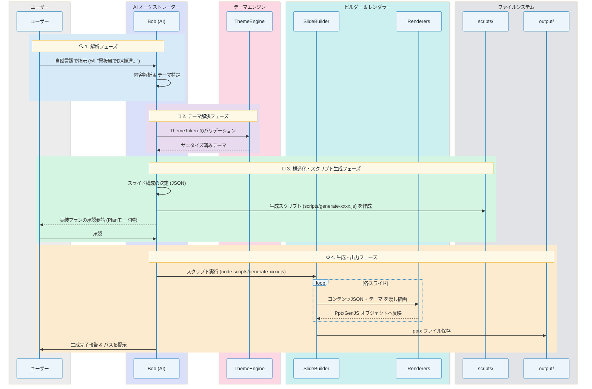
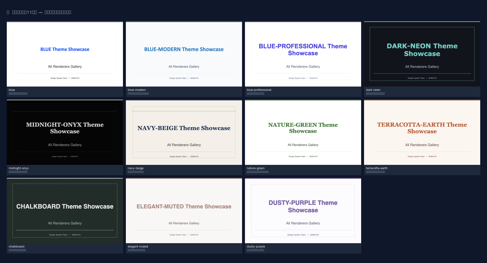
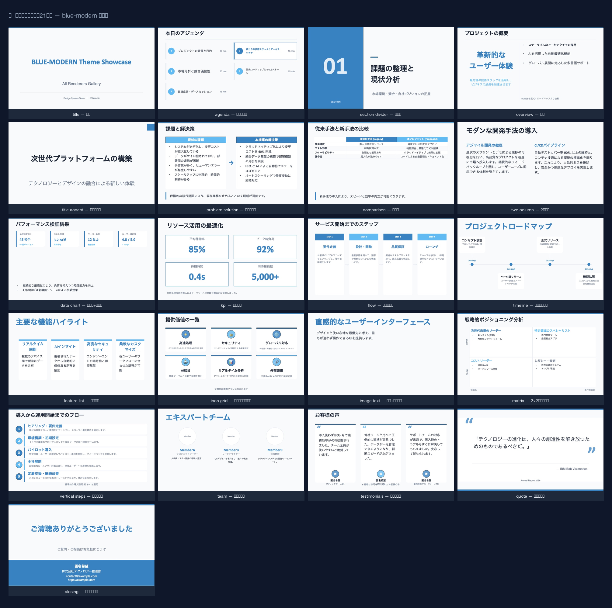

# pptx-generator: PowerPoint スライド生成スキル

> **IBM Bob 向けセットアップガイド**  
> 普通の文章（自然言語）で指示を出して、PowerPoint（.pptx）のスライドを自動で作成する IBM Bob 用の拡張機能(スキル)です。
>入力された文章をシステムが理解できる「デザインの設計図」に変換し、専用のプログラム（PptxGenJS）を使って実際のプレゼン資料を作成します。


(ご参考動画: 画像をクリックすると動画のリンクに飛びます)

<a href="https://www.youtube.com/watch?v=_Az0FOfImUg" target="_blank">
  
</a>

---

## 目次

1. [特徴](#特徴)
2. [前提条件](#前提条件)
3. [インストール](#インストール)
4. [スキルの仕組み](#スキルの仕組み)
5. [システム動作フロー](#システム動作フロー)
6. [スキルの有効化](#スキルの有効化)
7. [使い方](#使い方)
8. [テーマの指定方法](#テーマの指定方法)
9. [スライドタイプ（レンダラー）一覧](#スライドタイプレンダラー一覧)
10. [拡張とカスタマイズ](#拡張とカスタマイズ)
11. [ファイル構成](#ファイル構成)
12. [既知の制限事項 & トラブルシューティング](#既知の制限事項--トラブルシューティング)
13. [推奨事項](#推奨事項)
14. [関連リソース](#関連リソース)
15. [アンインストール](#アンインストール)
16. [免責事項](#免責事項)

---

## 特徴

- **自然言語でデザイン指定** — 「黒板風で」「青色ベースで」など日本語でそのまま指示できる
- **10種以上の組み込みテーマ** — ビジネスからクリエイティブまで、多様なシーンに対応する高品質テーマを収録
- **21種のスライドレンダラー** — タイトル、アジェンダ、比較、データ、タイムライン、チーム紹介など豊富なレイアウト
- **軽量・低コスト** — Visual QA（画像解析）機能を省くことで高速・低コストな生成を実現。そのため、生成後に人手による微調整が必要になる場合がある
- **最小限の依存関係** — 直接の依存は `pptxgenjs` のみ。サブ依存を含めても約20パッケージと非常に軽量で、導入リスクを最小限に抑えられます。
- **安全な生成** — `ThemeEngine` が色コードやフォントを自動サニタイズし、ファイル破損を防止

---

## 前提条件

| 要件 | バージョン | 用途 |
|---|---|---|
| Node.js | v18 以上 | スライド生成（PptxGenJS） |
| npm | v9 以上 | Node.js 依存関係管理 |
| Bob | 最新版（Advanced モード必須） | スキルとしての実行 |

> [!IMPORTANT]
> IBM Bob のスキルは **Advanced モード** でのみ動作します。  
> IBM Bob Settings → Mode → Advanced に切り替えてください。

---

## インストール

```bash
# 1. リポジトリをクローン
git clone https://github.com/cu0001/pptx-skills-pub.git
cd pptx-skills-pub

# 2. Node.js 依存関係のインストール
npm install
```

> [!TIP]
> 本プロジェクトが直接管理する依存関係は **`pptxgenjs` 1つのみ** です。`npm install` 実行時にはサブ依存を含め約20のパッケージが導入されますが、環境構築の手間と導入リスクを最小限に抑えています。
>
> `npm install` を実行すると、カレントディレクトリ内に `node_modules` フォルダが作成され、そこにパッケージがインストールされます。システム全体（グローバル）には影響を与えません。
>
> | パッケージ | バージョン | 用途 |
> |---|---|---|
> | pptxgenjs | ^3.12.0 | PowerPoint (.pptx) ファイルの生成 |

```bash
# 3. 出力ディレクトリの作成
mkdir -p output

# 4. 動作確認（全テーマ・全レンダラーのデモを生成）
npm run demo
# → output/ ディレクトリに各テーマのデモファイルが生成されれば OK
```

---

## スキルの仕組み

IBM Bob のスキルは、**`.bob/skills/` 配下の `SKILL.md`** を読み込み、Bob 自身がいつ・どのようにスキルを使うかを自動判断します。

```
.bob/skills/pptx-generator/SKILL.md   ← スキル定義
```

Bob がスライド生成の依頼を受けると、以下のフローで処理します：

1. **解析**: ユーザーの自然言語指示から、テーマ（ThemeToken）を決定。
2. **構造化**: コンテンツをスライドタイプごとの JSON に構造化。
3. **実行**: 内部的に生成スクリプトを呼び出し、`.pptx` を生成。
4. **出力**: `output/` フォルダに完成したファイルが保存される。

---

## システム動作フロー

ユーザーが Bob に指示を出してからスライドが完成するまでの詳細な流れは以下の通りです。



### 各フェーズの詳細

#### 1. 解析フェーズ (Intent Analysis)
Bob がユーザーの入力（例：「環境保護の報告書を、森をイメージしたデザインで作って」）を読み取り、以下の 2 点を抽出します。
- **テーマの選定**: 既存のテーマ（`nature-green` 等）を使うか、新しいデザイン（ThemeToken）を生成するか。
- **ページ構成**: タイトル、アジェンダ、重要項目、今後の展望など、スライドの論理構成を決定します。

#### 2. テーマ解決フェーズ (Theme Resolution)
`lib/ThemeEngine.js` が、AI が生成した、あるいは既存のテーマ設定をサニタイズします。
- 色コードから `#` を除去（PptxGenJS の仕様への適合）。
- クロスプラットフォームで安全なフォントへの自動フォールバック。
- 数値パラメータ（影のオフセット、角丸の半径など）のバリデーション。

#### 3. 構造化フェーズ (Content Structuring)
各スライドの内容を、特定の「レンダラー（例：`TitleRenderer`, `FlowRenderer`）」が受け取れる JSON 形式に変換します。これにより、AI は複雑な PptxGenJS の API を直接叩く必要がなくなり、安定したレイアウトが保証されます。

#### 4. 生成・出力フェーズ (Generation & Output)
Bob が一時的な生成スクリプト（例：`scripts/generate-xxxx.js`）をファイルとして書き出し、そのスクリプトを Node.js で実行することで PPTX を構築します。
- **SlideBuilder**: PptxGenJS インスタンスを保持し、テーマに応じた「表面（Surface）」や「アクセント（AccentBar）」を自動的に描画するラッパー。
- **Renderers**: 各スライドタイプに特化した描画ロジック。テキストの長さ調整やグリッド配置を行います。
- **output/**: 生成されたファイルは `output/` フォルダ配下に保存されます。実行完了後、一時的な生成スクリプトはユーザーが後で確認・再利用できるように残されます。

---

## スキルの有効化

### プロジェクトスキルとして使う（推奨）
プロジェクトディレクトリを VSCode / Bob で開くだけで自動認識されます。

### グローバルスキルとして使う
どのプロジェクトからでも利用可能にするには、以下のように配置します：
```bash
mkdir -p ~/.bob/skills/pptx-generator
cp .bob/skills/pptx-generator/SKILL.md ~/.bob/skills/pptx-generator/SKILL.md
```

> [!NOTE]
> スキル使用のたびに出る承認プロンプトをスキップするには：  
> **Bob Settings → Auto-Approve → Skills をオン** に設定してください。

---
## 🎯 推奨：段階的な品質改善フロー

以下は、実際に高品質なプレゼンテーションを生成した成功事例のフローです。**Plan モード**で設計を固めてから **Code モード**で実装することで、表示崩れのない完成度の高いスライドが得られます。

### ステップ1: Plan モードで設計を依頼

Markdown ファイルを指定して、プランを考えてもらいます。

```
「xxxxx.md」を元にPPTXを作成するプランを考えてください。
テーマ・デザインについても提案してください。
```

**Bob の動作**:
- Markdown ファイルの構造を分析
- スライド構成（16枚）を設計
- 2つのテーマ（blue / blue-modern）を提案
- 各スライドに最適なレンダラーを選定
- デザインの特徴と使い分けを説明

### ステップ2: テーマの追加提案を依頼（オプション）

複数のテーマを比較検討したい場合は、追加提案を依頼します。

```
blue-modern 追加提案もお願いします。
```

**Bob の動作**:
- blue-modern テーマの詳細なデザイン提案
- blue テーマとの比較表を作成
- 使い分けのシーン別推奨を提示

### ステップ3: 実装を承認

プランに納得したら、実装を開始します。

```
OK。Codeモードで進めてください。
```


**Bob の動作**:
- 自動的に Code モードに切り替え
- 生成スクリプト（例：`scripts/generate-xxxx.js`）を作成
- 両テーマで PPTX を生成
- `output/` フォルダに保存

### ステップ4: 表示問題の修正依頼

生成されたファイルを確認後、問題があれば具体的に指摘します。

```
p10, 11, 16 で綺麗に表示できていません。修正したいです。
renderers 採用から検討してください。
```

**Bob の動作**:
- 問題のあるスライドを分析
- より適切なレンダラーを選定
  - 例：ComparisonRenderer → FeatureListRenderer
  - 例：DataRenderer → OverviewRenderer
- 修正版を再生成

### ステップ5: 追加の微調整

さらに細かい問題があれば、段階的に修正を依頼します。

```
p6 と p12 が文字の重なりなどがある。修正方法を検討してください
```

**Bob の動作**:
- 文字重なりの原因を分析
- レンダラーを変更して解決
- 最終版を再生成

### ✅ このフローの利点

1. **設計と実装の分離**: Plan モードで構成を固めてから実装するため、手戻りが少ない。
2. **段階的な品質改善**: 問題を具体的に指摘することで、的確な修正が可能。
3. **レンダラーの最適化**: 表示問題に応じて最適なレンダラーを選択。
4. **テーマの比較検討**: 複数テーマを提案してもらい、用途に応じて選択可能。

### 📋 依頼時のポイント
- **具体的なファイル名を指定**: 「xxxxxxx.md を元に」などと指定する。
- **問題箇所を明確に**: 「p10, 11, 16 で表示崩れ」などと具体的に伝える。
- **修正の方向性を示す**: 「renderers 採用から検討」などと方針を提示する。
- **段階的に確認**: 一度に全て修正せず、確認しながら進める。

---

## 使い方

### 自然言語で指示する
Bob のチャット欄に話しかけるだけです。

```
「自然をイメージしたエコなデザインで、環境保護活動の報告スライドを5枚作ってください」
「高級感のあるゴールドを基調に、次世代ラグジュアリーホテルの提案資料を作って」
「サイバーパンク風（dark-neon テーマ）で、5ステップの DX 推進フロー図を1枚作ってください」
```

### 具体的なデザインプロンプトを使用する
配色やフォントを指定して指示を出すことも可能です。

```
以下のデザイン指示でスライドを作ってください：
---
## ビジュアルスタイル: Chalkboard / Hand-drawn
### 配色
- 背景: #2E8B57 (Sea Green)
- 文字色: #FFFFFF
---
コンテンツ:「学習サポートシステムの概要スライド1枚（overviewタイプ）」
```

---

## テーマの指定方法

10種類以上のテーマから ID または自然言語で指定できます。



| テーマID | スタイル | 利用シーン |
|---|---|---|
| `blue` | コーポレートブルー | 技術説明・エンタープライズ |
| `blue-modern` | クリーン・フラット | IT・ビジネス・スタートアップ |
| `blue-professional` | 信頼感のあるクリーン | プロダクト紹介・価値訴求 |
| `dark-neon` | サイバーパンク・ネオン | テクノロジー・未来・ゲーム |
| `midnight-onyx` | 洗練されたダーク・ブラック | ハイエンド・プロフェッショナル・エグゼクティブ |
| `navy-beige` | 紺＆生成り（和モダン） | 伝統文化・高級和食用・禅 |
| `nature-green` | 自然・グリーン | 環境・持続可能性・オーガニック |
| `terracotta-earth` | 温もり・アースカラー | 食品・ライフスタイル・健康 |
| `cafe-latte` | カフェ・ラテ・温もり | カフェ・飲食店・ライフスタイル・美容 |
| `dusty-purple` | くすみ紫・上品 | クリエイティブ・ライフスタイル・洗練 |
| `chalkboard` | 黒板・手書き・温もり | 教育・カフェ・カジュアル |
| `elegant-muted` | 上品なくすみ色・ウォーム | 洗練されたライフスタイル・美容・デザイン |

---

## スライドタイプ（レンダラー）一覧

21種類の高度なレンダラーを搭載し、あらゆるコンテンツに対応します。blue-modernテーマを使用した際の全スライドタイプを表示しています。

スライドはプレゼンの流れに沿って以下の順で生成されます。

| カテゴリ | タイプ | 説明 |
|---|---|---|
| **基本** | `title` | 表紙・タイトル |
| | `titleaccent` | アクセント付きタイトル（視覚的強調） |
| | `agenda` | ハイライト機能付きアジェンダ |
| | `sectiondivider` | セクション区切りスライド |
| **内容** | `overview` | キーワード重視の概要スライド |
| | `twocolumn` | 2カラム構成の詳細説明 |
| | `quote` | 装飾引用符付きの引用・名言 |
| **分析** | `problemsolution` | 課題と解決策の対比 |
| | `comparison` | 比較表とインサイト |
| | `matrix` | 2×2 マトリックス分析 |
| **データ** | `datachart` | KPI カードとチャートの複合スライド |
| | `kpi` | 主要数値の強調表示 |
| **プロセス** | `flow` | ステップ形式のプロセス図 |
| | `timeline` | 時系列のロードマップ |
| | `verticalsteps` | 縦並びの詳細ステップ |
| **紹介** | `featurelist` | アイコン付きの機能一覧 |
| | `icongrid` | アイコングリッドによる価値訴求 |
| | `imagetext` | 画像とテキストのバランスの取れた配置 |
| | `team` | メンバー紹介（氏名・役割・略歴） |
| | `testimonials` | お客様の声（匿名対応） |
| **締め** | `closing` | クロージング・連絡先 |

---

## 拡張とカスタマイズ

### カスタムテーマの追加
`themes/schema.json` に従って JSON ファイルを作成し、`themes/index.js` に登録します。

```json
{
  "id": "my-theme",
  "name": "My Theme",
  "colors": {
    "background": "1A1A2E",
    "primary": "E94560",
    "text": "FFFFFF"
  },
  "typography": {
    "fontTitle": "Outfit",
    "fontBody": "Inter"
  }
}
```

> [!CAUTION]
> - 色コードに **`#` を含めないこと**（PptxGenJS の仕様上、ファイルが開けなくなる原因になります）
> - 影の設定 (`shadow.offset`) は **必ず 0 以上** に設定してください。

---

## ファイル構成

```
.
├── .bob/
│   └── skills/
│       └── pptx-generator/
│           └── SKILL.md          ← Bob スキル定義
├── lib/
│   ├── ThemeEngine.js            ← テーマ検証・サニタイズ
│   ├── SlideBuilder.js           ← PptxGenJS 安全ラッパー
│   ├── LayoutCalculator.js       ← レイアウト計算（マージン等）
│   ├── TextFitCalculator.js      ← テキストフィット計算
│   ├── constants.js              ← 定数定義
│   └── renderers/                ← 21種のレンダラー
├── themes/
│   ├── index.js                  ← テーマ登録・管理
│   ├── schema.json               ← ThemeToken の型仕様
│   └── *.json                    ← 各テーマ定義
├── prompts/                      ← AI (Bob) 向けプロンプト集
├── scripts/                      ← 各種ユーティリティ・生成スクリプト
│   └── demo-all.js               ← 全機能確認用デモ
├── output/                       ← 生成物の出力先（.gitignore 対象）
├── index.js                      ← メインエントリ
└── README.md                     ← このファイル
```

---

## 既知の制限事項 & トラブルシューティング

| 項目 | 詳細 |
|---|---|
| **モード** | **Advanced モード必須**です。ご注意ください。 |
| **色コード** | `#` が含まれていると生成エラーになる場合があります。`ThemeEngine` が自動除去を試みますが、指定時は `6桁 HEX` でご入力いただくことを推奨します。 |
| **フォント** | 安全フォント (`Arial`, `Calibri`, `Meiryo`, `Yu Gothic` 等) 以外をご指定いただいた場合は、自動でフォールバックされますのでご了承ください。 |
| **アニメーション** | 現時点では PptxGenJS の制限により、スライドアニメーションには対応しておりません。 |
| **ビジュアル確認** | 現時点では生成結果に対する画像解析（Visual QA）には対応しておりません。文字重なり等が発生した場合は、お手数ですが手動または AI への再指示による調整をお願いいたします。 |

### トラブルシューティング
- **スキルが起動しない**: `Advanced モード` か確認してください。
- **モジュールエラー**: `npm install` を再実行してください。
- **ファイルが破損している**: `ThemeEngine.js` のログを確認し、不正な色コードや負の数値パラメータがないか確認してください。
- **レンダラーエラー（`Cannot read properties of undefined`）**: 各レンダラーは特定のJSONスキーマを期待します。以下を確認してください：
  - `OverviewRenderer`: `mainKeyword`（必須）と`summaryItems`（オブジェクト配列）
  - `TwoColumnRenderer`: `leftSection`/`rightSection`（`leftContent`ではない）で、各セクションは`heading`と`text`（文字列）
  - `FeatureListRenderer`: `features`（オブジェクト配列）
  - 詳細は `.bob/skills/pptx-generator/SKILL.md` の「レンダラー使用時の重要な注意事項」を参照

---

## 推奨事項

本プロジェクトを安全かつ安定して利用・拡張するために、以下の事項を推奨します。

### 1. 開発環境の再現性と整合性
- **`package-lock.json` の管理**: すべての依存関係の正確なバージョンを固定し、環境間での動作の差異を防止するために、このファイルは必ず Git 管理下に含めてください。
- **クリーンなインストール**: 新しい環境でのセットアップ時は、`npm install` よりも `npm ci` を使用することで、`package-lock.json` に基づいた厳密な再現が可能です。

### 2. セキュリティと定期的なメンテナンス
- **脆弱性診断の実行**: 定期的に `npm audit` を実行し、依存パッケージの既知の脆弱性をチェックすることを推奨します。
- **パッチの適用**: 必要に応じて `npm update` を検討し、セキュリティパッチが適用された最新の安定バージョンを維持してください。

### 3. モジュールの選定と最小依存の原則
- **信頼性の確認**: 新たなライブラリを導入する際は、ダウンロード数、メンテナンス頻度、公式ドキュメントの整備状況を考慮し、信頼できるものを選択してください。
- **シンプルさの維持**: 標準 API で実現可能な機能については外部モジュールへの依存を避け、プロジェクトの複雑さと攻撃面（Attack Surface）を最小限に抑えるよう努めてください。

### 4. ライセンスの確認
- **コンプライアンスの遵守**: 導入する各モジュールのライセンス（MIT, Apache-2.0, BSD 等）が利用目的に適合しているか、事前に確認してください。

---

## 関連リソース
- [PptxGenJS](https://gitbrent.github.io/PptxGenJS/) — スライド生成ライブラリ
- [Bob Skills Docs](https://bob.ibm.com/docs/ide/features/skills) — スキル開発ドキュメント

---

## アンインストール

本プロジェクトはカレントディレクトリの `node_modules` にのみ依存関係を保持するため、プロジェクトディレクトリを削除するだけで、導入されたモジュールを含めシステムを汚さず完全に削除できます。

各コマンドを順番に実行してください。ディレクトリ削除は元に戻せない操作ですので、実行前に内容をご確認いただくようお願いいたします。

```bash
# 依存モジュールの削除
npm uninstall pptxgenjs

# プロジェクトディレクトリごと削除する場合
rm -rf /path/to/pptx-skills-pub

# グローバルスキルを登録した場合
rm -rf ~/.bob/skills/pptx-generator
```

### 生成ファイルのクリーンアップ

スライド生成のたびに以下のファイルが蓄積されます。不要になった場合は削除してください。

| ファイル | 説明 | 削除コマンド |
|---|---|---|
| `output/*.pptx` | 生成された PowerPoint ファイル | `rm output/*.pptx` |
| `scripts/generate-*.js` | 生成時に作成された一時スクリプト | `rm scripts/generate-*.js` |

```bash
# output/ と scripts/ の生成ファイルをまとめて削除
rm -f output/*.pptx scripts/generate-*.js
```

> [!NOTE]
> `scripts/generate-*.js` は再利用・確認のために意図的に残されます。過去の生成内容を参照する必要がなくなった時点で削除してください。

---

## 免責事項

本スキルをご利用いただきありがとうございます。安心してお使いいただくために、以下の免責事項をご確認ください。

本ソフトウェアは「現状のまま（AS IS）」提供され、明示的か暗示的かを問わず、その品質、性能、特定目的への適合性、または権利侵害の不在について、一切の保証（法的保証を含む）を負いません。本ソフトウェアの使用に起因して生じた直接的、間接的、偶発的、または特別な損害（利益の損失、データの損失、業務の中断等を含む）について、作者および著作権者は一切の責任を負いません。ご利用の際は、ユーザー自身の責任において十分な検証を行っていただきますようお願いいたします。
