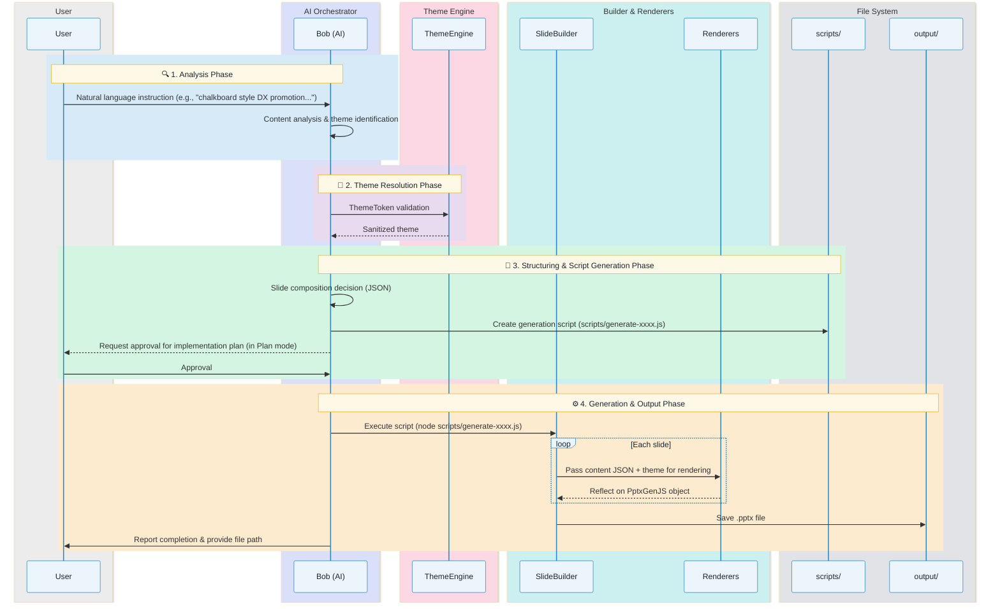

# pptx-generator: PowerPoint Slide Generation Skill

> **Setup Guide for IBM Bob**  
> An IBM Bob extension (skill) that automatically creates PowerPoint (.pptx) slides from natural language instructions.
> The system converts your input text into a structured "design blueprint" and uses a dedicated library (PptxGenJS) to generate actual presentation materials.


(Reference video: Click the image to open the video link)

<a href="https://www.youtube.com/watch?v=_Az0FOfImUg" target="_blank">
  
</a>

---

## Table of Contents

1. [Features](#features)
2. [Prerequisites](#prerequisites)
3. [Installation](#installation)
4. [How the Skill Works](#how-the-skill-works)
5. [System Workflow](#system-workflow)
6. [Enabling the Skill](#enabling-the-skill)
7. [Usage](#usage)
8. [Theme Selection](#theme-selection)
9. [Slide Types (Renderers)](#slide-types-renderers)
10. [Extension and Customization](#extension-and-customization)
11. [File Structure](#file-structure)
12. [Known Limitations & Troubleshooting](#known-limitations--troubleshooting)
13. [Recommendations](#recommendations)
14. [Related Resources](#related-resources)
15. [Uninstallation](#uninstallation)
16. [Disclaimer](#disclaimer)

---

## Features

- **Natural Language Design Specification** — Give instructions in plain language, such as "chalkboard style" or "blue-based design"
- **10+ Built-in Themes** — High-quality themes covering a wide range of scenarios from business to creative
- **21 Slide Renderers** — Rich layouts including title, agenda, comparison, data, timeline, team introduction, and more
- **Lightweight & Cost-Efficient** — By omitting Visual QA (image analysis), the system achieves fast, low-cost generation. As a result, manual fine-tuning may be needed after generation
- **Minimal Dependencies** — The only direct dependency is `pptxgenjs`. Including sub-dependencies, it's only about 20 packages, keeping deployment risk minimal
- **Safe Generation** — `ThemeEngine` automatically sanitizes color codes and fonts to prevent file corruption

---

## Prerequisites

| Requirement | Version | Purpose |
|---|---|---|
| Node.js | v18 or later | Slide generation (PptxGenJS) |
| npm | v9 or later | Node.js dependency management |
| Bob | Latest version (Advanced mode required) | Execution as a skill |

> [!IMPORTANT]
> IBM Bob skills only work in **Advanced mode**.  
> Switch to IBM Bob Settings → Mode → Advanced.

---

## Installation

```bash
# 1. Clone the repository
git clone https://github.com/cu0001/pptx-skills-pub.git
cd pptx-skills-pub

# 2. Install Node.js dependencies
npm install
```

> [!TIP]
> This project directly manages only **one dependency: `pptxgenjs`**. Running `npm install` will install approximately 20 packages including sub-dependencies, but the setup effort and deployment risk are kept to a minimum.
>
> Running `npm install` creates a `node_modules` folder in the current directory where packages are installed. It does not affect the global system environment.
>
> | Package | Version | Purpose |
> |---|---|---|
> | pptxgenjs | ^3.12.0 | PowerPoint (.pptx) file generation |

```bash
# 3. Create the output directory
mkdir -p output

# 4. Verify installation (generate demos for all themes and renderers)
npm run demo
# → If demo files are generated in the output/ directory, setup is complete
```

---

## How the Skill Works

IBM Bob skills read **`SKILL.md` files under `.bob/skills/`**, and Bob automatically determines when and how to use each skill.

```
.bob/skills/pptx-generator/SKILL.md   ← Skill definition
```

When Bob receives a slide generation request, it processes it through the following flow:

1. **Analysis**: Determines the theme (ThemeToken) from the user's natural language instructions.
2. **Structuring**: Structures the content into JSON format for each slide type.
3. **Execution**: Internally calls the generation script to produce the `.pptx` file.
4. **Output**: The completed file is saved to the `output/` folder.

---

## System Workflow

The detailed flow from when a user gives Bob an instruction to when the slides are completed is shown below.



### Phase Details

#### 1. Analysis Phase (Intent Analysis)
Bob reads the user's input (e.g., "Create an environmental report with a forest-inspired design") and extracts two key elements:
- **Theme selection**: Whether to use an existing theme (e.g., `nature-green`) or generate a new design (ThemeToken).
- **Page structure**: Determines the logical composition of slides, including title, agenda, key items, future outlook, etc.

#### 2. Theme Resolution Phase
`lib/ThemeEngine.js` sanitizes the theme settings generated by the AI or retrieved from existing themes.
- Removes `#` from color codes (to comply with PptxGenJS specifications).
- Automatic fallback to cross-platform safe fonts.
- Validates numeric parameters (shadow offset, border radius, etc.).

#### 3. Structuring Phase (Content Structuring)
Converts each slide's content into JSON format that specific "renderers" (e.g., `TitleRenderer`, `FlowRenderer`) can consume. This eliminates the need for the AI to directly call the complex PptxGenJS API, ensuring stable layouts.

#### 4. Generation & Output Phase
Bob writes a temporary generation script (e.g., `scripts/generate-xxxx.js`) as a file and executes it with Node.js to build the PPTX.
- **SlideBuilder**: A wrapper that holds the PptxGenJS instance and automatically draws "surfaces" and "accent bars" based on the theme.
- **Renderers**: Drawing logic specialized for each slide type. Handles text length adjustment and grid positioning.
- **output/**: Generated files are saved under the `output/` folder. After execution, temporary generation scripts are intentionally kept so users can review or reuse them later.

---

## Enabling the Skill

### Use as a Project Skill (Recommended)
Simply open the project directory in VSCode / Bob, and the skill will be automatically recognized.

### Use as a Global Skill
To make it available from any project, place the file as follows:
```bash
mkdir -p ~/.bob/skills/pptx-generator
cp .bob/skills/pptx-generator/SKILL.md ~/.bob/skills/pptx-generator/SKILL.md
```

> [!NOTE]
> To skip the approval prompt that appears each time a skill is used:  
> Set **Bob Settings → Auto-Approve → Skills to ON**.

---
## 🎯 Recommended: Iterative Quality Improvement Flow

The following is a proven workflow that has successfully produced high-quality presentations. By finalizing the design in **Plan mode** before implementing in **Code mode**, you can achieve polished slides without layout issues.

### Step 1: Request Design in Plan Mode

Specify a Markdown file and ask for a plan.

```
Please create a plan for generating a PPTX based on "xxxxx.md".
Also suggest themes and design options.
```

**Bob's behavior**:
- Analyzes the Markdown file structure
- Designs slide composition (e.g., 16 slides)
- Proposes two themes (e.g., blue / blue-modern)
- Selects the optimal renderer for each slide
- Explains design features and use cases

### Step 2: Request Additional Theme Proposals (Optional)

If you want to compare multiple themes, request additional proposals.

```
Please also propose a blue-modern option.
```

**Bob's behavior**:
- Provides detailed design proposal for the blue-modern theme
- Creates a comparison table with the blue theme
- Recommends themes for different scenarios

### Step 3: Approve Implementation

Once satisfied with the plan, start implementation.

```
OK. Please proceed in Code mode.
```

**Bob's behavior**:
- Automatically switches to Code mode
- Creates generation script (e.g., `scripts/generate-xxxx.js`)
- Generates PPTX in both themes
- Saves to `output/` folder

### Step 4: Request Fixes for Display Issues

After reviewing the generated files, provide specific feedback on any issues.

```
Pages 10, 11, and 16 are not displaying properly. I'd like to fix them.
Please reconsider starting from renderer selection.
```

**Bob's behavior**:
- Analyzes the problematic slides
- Selects more appropriate renderers
  - e.g., ComparisonRenderer → FeatureListRenderer
  - e.g., DataRenderer → OverviewRenderer
- Regenerates the corrected version

### Step 5: Additional Fine-tuning

If there are further minor issues, request incremental fixes.

```
Pages 6 and 12 have text overlapping issues. Please consider how to fix them.
```

**Bob's behavior**:
- Analyzes the cause of text overlap
- Resolves by changing renderers
- Regenerates the final version

### ✅ Benefits of This Flow

1. **Separation of Design and Implementation**: Finalizing the structure in Plan mode before implementation reduces rework.
2. **Iterative Quality Improvement**: Providing specific feedback on issues enables precise corrections.
3. **Renderer Optimization**: Selects the optimal renderer based on display issues.
4. **Theme Comparison**: Request multiple theme proposals and choose based on your needs.

### 📋 Tips for Effective Requests
- **Specify exact file names**: e.g., "Based on xxxxxxx.md"
- **Be specific about issues**: e.g., "Layout broken on pages 10, 11, 16"
- **Suggest a direction for fixes**: e.g., "Reconsider renderer selection"
- **Review incrementally**: Don't try to fix everything at once; proceed step by step.

---

## Usage

### Give Instructions in Natural Language
Simply type in Bob's chat window.

```
"Create a 5-slide report on environmental activities with a nature-inspired eco design"
"Create a proposal for a next-generation luxury hotel with an elegant gold-based design"
"Create a 1-slide DX promotion flow diagram with 5 steps in a cyberpunk style (dark-neon theme)"
```

### Use Specific Design Prompts
You can also give instructions specifying color schemes and fonts.

```
Please create slides with the following design instructions:
---
## Visual Style: Chalkboard / Hand-drawn
### Color Scheme
- Background: #2E8B57 (Sea Green)
- Text Color: #FFFFFF
---
Content: "1 overview slide for a learning support system"
```

---

## Theme Selection

Choose from 10+ themes by ID or natural language description.


| Theme ID | Style | Use Case |
|---|---|---|
| `blue` | Corporate Blue | Technical explanations, enterprise |
| `blue-modern` | Clean & Flat | IT, business, startups |
| `blue-professional` | Trustworthy & Clean | Product introductions, value propositions |
| `dark-neon` | Cyberpunk & Neon | Technology, futuristic, gaming |
| `midnight-onyx` | Refined Dark & Black | High-end, professional, executive |
| `navy-beige` | Navy & Ivory (Japanese modern) | Traditional culture, fine dining, zen |
| `nature-green` | Nature & Green | Environment, sustainability, organic |
| `terracotta-earth` | Warm & Earthy | Food, lifestyle, health |
| `cafe-latte` | Café & Latte, Warm | Cafés, restaurants, lifestyle, beauty |
| `dusty-purple` | Muted Purple & Elegant | Creative, lifestyle, sophisticated |
| `chalkboard` | Chalkboard, Handwritten, Warm | Education, cafés, casual |
| `elegant-muted` | Elegant Muted & Warm | Sophisticated lifestyle, beauty, design |

---

## Slide Types (Renderers)

Equipped with 21 advanced renderers to handle any type of content. The following shows all slide types rendered with the blue-modern theme.

Slides are generated in the following order, aligned with a typical presentation flow.

| Category | Type | Description |
|---|---|---|
| **Basic** | `title` | Cover / title slide |
| | `titleaccent` | Accented title (visual emphasis) |
| | `agenda` | Agenda with highlight functionality |
| | `sectiondivider` | Section divider slide |
| **Content** | `overview` | Keyword-focused overview slide |
| | `twocolumn` | Two-column detailed explanation |
| | `quote` | Quotation with decorative quote marks |
| **Analysis** | `problemsolution` | Problem & solution comparison |
| | `comparison` | Comparison table with insights |
| | `matrix` | 2×2 matrix analysis |
| **Data** | `datachart` | Combined KPI cards and charts |
| | `kpi` | Key metric emphasis display |
| **Process** | `flow` | Step-based process diagram |
| | `timeline` | Chronological roadmap |
| | `verticalsteps` | Vertically arranged detailed steps |
| **Introduction** | `featurelist` | Feature list with icons |
| | `icongrid` | Icon grid for value proposition |
| | `imagetext` | Balanced image and text layout |
| | `team` | Team member introduction (name, role, bio) |
| | `testimonials` | Customer testimonials (anonymous supported) |
| **Closing** | `closing` | Closing / contact information |

---

## Extension and Customization

### Adding Custom Themes
Create a JSON file following `themes/schema.json` and register it in `themes/index.js`.

```json
{
  "id": "my-theme",
  "name": "My Theme",
  "colors": {
    "background": "1A1A2E",
    "primary": "E94560",
    "text": "FFFFFF"
  },
  "typography": {
    "fontTitle": "Outfit",
    "fontBody": "Inter"
  }
}
```

> [!CAUTION]
> - **Do NOT include `#` in color codes** (Due to PptxGenJS specifications, this will cause the file to become unopenable)
> - Shadow settings (`shadow.offset`) **must be 0 or greater**.

---

## File Structure

```
.
├── .bob/
│   └── skills/
│       └── pptx-generator/
│           └── SKILL.md          ← Bob skill definition
├── lib/
│   ├── ThemeEngine.js            ← Theme validation & sanitization
│   ├── SlideBuilder.js           ← PptxGenJS safe wrapper
│   ├── LayoutCalculator.js       ← Layout calculation (margins, etc.)
│   ├── TextFitCalculator.js      ← Text fit calculation
│   ├── constants.js              ← Constant definitions
│   └── renderers/                ← 21 renderers
├── themes/
│   ├── index.js                  ← Theme registration & management
│   ├── schema.json               ← ThemeToken type specification
│   └── *.json                    ← Individual theme definitions
├── prompts/                      ← AI (Bob) prompt collection
├── scripts/                      ← Utility & generation scripts
│   └── demo-all.js               ← Full feature demo
├── output/                       ← Output directory (.gitignore target)
├── index.js                      ← Main entry point
└── README.md                     ← This file
```

---

## Known Limitations & Troubleshooting

| Item | Details |
|---|---|
| **Mode** | **Advanced mode is required**. Please be aware of this. |
| **Color codes** | Including `#` may cause generation errors. `ThemeEngine` attempts auto-removal, but we recommend entering colors as `6-digit HEX` values. |
| **Fonts** | If a font other than safe fonts (`Arial`, `Calibri`, `Meiryo`, `Yu Gothic`, etc.) is specified, it will be automatically replaced with a fallback font. |
| **Animations** | Slide animations are not currently supported due to PptxGenJS limitations. |
| **Visual verification** | Image-based Visual QA on generated results is not currently supported. If text overlapping or other issues occur, please adjust manually or re-instruct the AI. |

### Troubleshooting
- **Skill doesn't start**: Verify that you are in `Advanced mode`.
- **Module errors**: Re-run `npm install`.
- **File is corrupted**: Check `ThemeEngine.js` logs for invalid color codes or negative numeric parameters.
- **Renderer errors (`Cannot read properties of undefined`)**: Each renderer expects a specific JSON schema. Verify the following:
  - `OverviewRenderer`: `mainKeyword` (required) and `summaryItems` (array of objects)
  - `TwoColumnRenderer`: `leftSection`/`rightSection` (not `leftContent`), each with `heading` and `text` (string)
  - `FeatureListRenderer`: `features` (array of objects)
  - For details, see the "Important Notes on Renderer Usage" section in `.bob/skills/pptx-generator/SKILL.md`

---

## Recommendations

The following recommendations are provided for safe and stable use and extension of this project.

### 1. Development Environment Reproducibility and Consistency
- **Managing `package-lock.json`**: To lock exact versions of all dependencies and prevent behavioral differences across environments, always include this file under Git version control.
- **Clean installs**: When setting up a new environment, use `npm ci` instead of `npm install` for strict reproduction based on `package-lock.json`.

### 2. Security and Regular Maintenance
- **Run vulnerability scans**: Regularly run `npm audit` to check for known vulnerabilities in dependent packages.
- **Apply patches**: Consider running `npm update` as needed to maintain the latest stable versions with security patches applied.

### 3. Module Selection and Minimal Dependency Principle
- **Verify reliability**: When introducing new libraries, consider download counts, maintenance frequency, and official documentation quality to select trustworthy ones.
- **Maintain simplicity**: Avoid relying on external modules for functionality achievable with standard APIs. Strive to minimize project complexity and attack surface.

### 4. License Verification
- **Compliance**: Verify in advance that the license of each module being introduced (MIT, Apache-2.0, BSD, etc.) is compatible with your intended use.

---

## Related Resources
- [PptxGenJS](https://gitbrent.github.io/PptxGenJS/) — Slide generation library
- [Bob Skills Docs](https://bob.ibm.com/docs/ide/features/skills) — Skill development documentation

---

## Uninstallation

This project keeps all dependencies in the local `node_modules` directory, so you can completely remove everything — including all installed modules — by simply deleting the project directory, without polluting your system.

Please execute each command in order. Directory deletion is an irreversible operation, so please verify the contents before proceeding.

```bash
# Remove dependent modules
npm uninstall pptxgenjs

# To delete the entire project directory
rm -rf /path/to/pptx-skills-pub

# If you registered the global skill
rm -rf ~/.bob/skills/pptx-generator
```

### Cleaning Up Generated Files

The following files accumulate with each slide generation. Delete them when no longer needed.

| File | Description | Delete Command |
|---|---|---|
| `output/*.pptx` | Generated PowerPoint files | `rm output/*.pptx` |
| `scripts/generate-*.js` | Temporary scripts created during generation | `rm scripts/generate-*.js` |

```bash
# Delete all generated files in output/ and scripts/ at once
rm -f output/*.pptx scripts/generate-*.js
```

> [!NOTE]
> `scripts/generate-*.js` files are intentionally kept for reuse and review. Delete them when you no longer need to reference past generation content.

---

## Disclaimer

Thank you for using this skill. Please review the following disclaimer for your peace of mind.

This software is provided "AS IS," without warranty of any kind, express or implied, including but not limited to the warranties of merchantability, fitness for a particular purpose, and noninfringement. In no event shall the authors or copyright holders be liable for any direct, indirect, incidental, or special damages (including but not limited to loss of profits, loss of data, or business interruption) arising out of the use of this software. Users are responsible for conducting thorough verification before use.
